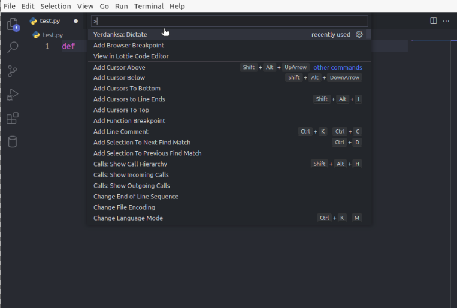
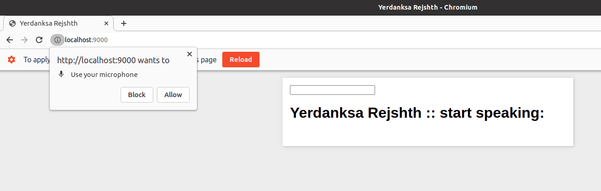
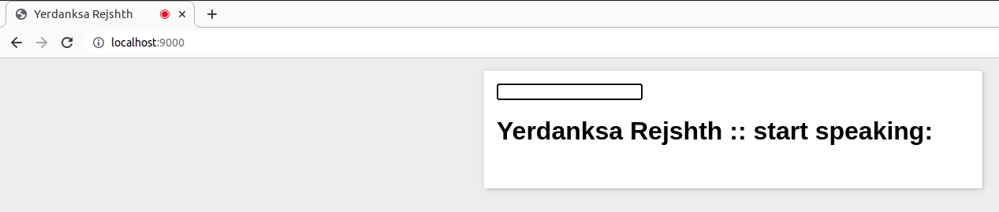

# README

form Yerdanksa
extension for Visual Studio Code.

## Features

<i>The command palette.</i>   

<i>The extension will ask you for permission to use your microphone.</i>   

<i>Address bar in Chrome when you've allowed access to your microphone.</i>   

## استفاده

1. command palette در `cmd/ctrl+shift+p` اجرای
2. command در قسمت `Yerdanksa: Dictate` اجرای
3. در آدرس مرورگر وارد کنید `localhost:9000` اگر به صورت اتوماتیک مرورگر اجرا نشد به صورت دستی مرورگر کروم را باز کنید و پورت
4. در صورتی که مرورگر اجازه دسترسی به میکروفون را خواست این اجازه را صادر کنید
5. شروع به صحبت کردن کنید

> توجه: برنامه افزودنی فقط روی فایل هایی که قبلاً روی دیسک ذخیره شده اند کار می کند.

## <a name="commands">Commands</a>

> کلمات کلیدی

| line | add new Line |
| parentheses | add "( )" |
| equal | add "=" |
| brace | add "{ }" |
| space | add " " |
| colon | add ":" |
| double quotation | add "" "" |
| single quotation | add "' '" |
| pline | Move cursor prevBlankLine. |
| nline | Move cursor nextBlankLine. |
| down | Move cursor down. |
| enter | Accept current IntelliSense suggestion. |
| left | Move cursor left. |
| next | Select next IntelliSense suggestion. |
| previous | Select previous IntelliSense suggestion. |
| right | Move cursor right. |
| up | Move cursor up. |

## الزامات

1. VS Code
2. microphone
3. Internet connection.
4. A browser that supports the Web Speech API
5. Available ports `9000` and `9001`.
